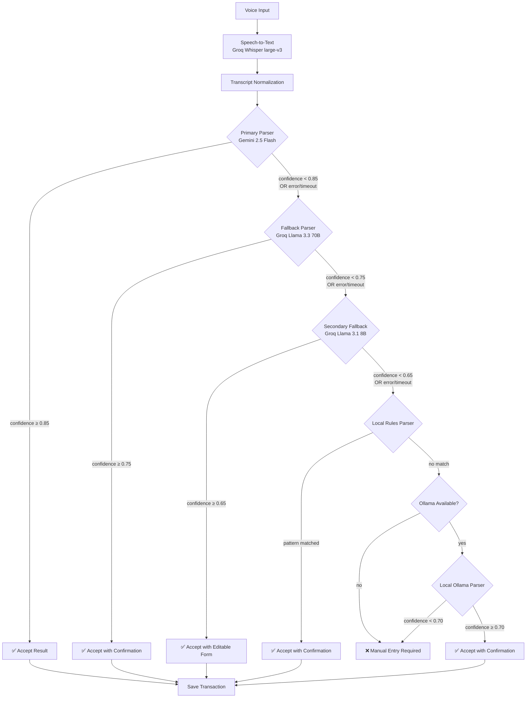
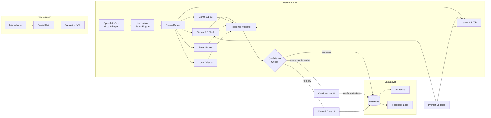

# AI/ML Architecture — ShopMind

## Overview

ShopMind uses a multi-stage AI pipeline to convert voice input from merchants into structured transaction data. The system is designed for:

- **Multilingual support** — Hindi, English, Hinglish, and regional languages
- **High accuracy** — cascading parsers with confidence scoring
- **Resilience** — graceful degradation through fallback chain
- **Cost efficiency** — tiered model usage based on complexity
- **Offline capability** — local rules parser and optional Ollama models

---

## Provider Abstraction Layer

All AI providers implement a common `TransactionParser` interface, enabling hot-swapping and A/B testing:

```typescript
interface ParsedTransaction {
  intent: Intent;
  item?: string;
  quantity?: number;
  unit?: string;
  amount?: number;
  customer?: string;
  payment_mode?: PaymentMode;
  due_status?: DueStatus;
  confidence: number;
  raw_transcript: string;
  normalized_transcript: string;
}

type Intent =
  | "sale"
  | "expense"
  | "credit_given"
  | "credit_received"
  | "stock_update"
  | "stock_check"
  | "return";

type PaymentMode = "cash" | "upi" | "card" | "credit" | "other";
type DueStatus = "paid" | "due" | "partial";

interface TransactionParser {
  readonly provider: string;
  readonly model: string;
  readonly priority: number;

  parse(transcript: string, context?: MerchantContext): Promise<ParsedTransaction>;
  isAvailable(): Promise<boolean>;
  getQuotaStatus(): Promise<QuotaStatus>;
}

interface MerchantContext {
  businessType: string;
  commonItems: string[];
  regularCustomers: string[];
  preferredLanguage: string;
  recentTransactions: ParsedTransaction[];
}

interface QuotaStatus {
  remaining: number;
  resetAt: Date;
  isExhausted: boolean;
}
```

---

## Pipeline Stages

### Stage 1: Speech-to-Text

| Property | Value |
|----------|-------|
| **Provider** | Groq |
| **Model** | Whisper large-v3 |
| **Input** | Audio blob (WebM/Opus, max 25MB) |
| **Output** | Raw transcript string |
| **Latency** | ~1-3s for typical utterances |
| **Languages** | Auto-detected; Hindi, English, Hinglish |

**Implementation Details:**
- Audio is captured via Web Audio API with noise suppression
- Silence detection triggers automatic end-of-utterance
- Audio is chunked if >25MB (rare for voice transactions)
- Language hint is sent based on user preference for faster detection

---

### Stage 2: Transcript Normalization

A deterministic pre-processing step that standardizes the raw transcript before LLM parsing:

| Transform | Example |
|-----------|---------|
| **Units** | "do kilo" → "2 kg", "paanch meter" → "5 m" |
| **Numerals** | "paanch sau" → "500", "dedh" → "1.5" |
| **Currency** | "paanch sau rupaye" → "₹500", "teen hazaar" → "₹3000" |
| **Entities** | "Sharma ji" → customer entity, "atta" → item entity |

**Rules Engine:**
- Hindi/Hinglish numeral dictionary (ek→1, do→2, ... sau→100, hazaar→1000)
- Unit aliases (kilo/kg/kilogram, packet/pkt, dozen/darjan)
- Currency patterns (rupaye, rupees, rs, ₹)
- Common merchant abbreviations

---

### Stage 3: Primary Parser — Gemini 2.5 Flash

| Property | Value |
|----------|-------|
| **Provider** | Google AI |
| **Model** | Gemini 2.5 Flash |
| **Role** | Intent classification, slot extraction, JSON generation, language normalization |
| **Confidence threshold** | ≥ 0.85 to accept |
| **Avg latency** | 0.5–1.5s |
| **Cost** | ~$0.15 per 1M input tokens |

**Responsibilities:**
1. **Intent Classification** — Determine transaction type from taxonomy
2. **Slot Extraction** — Extract structured fields from normalized transcript
3. **JSON Generation** — Output valid `ParsedTransaction` JSON
4. **Language Normalization** — Standardize multilingual input to canonical form
5. **Ambiguity Resolution** — Use merchant context to resolve unclear references

---

### Stage 4: Fallback Parser — Groq Llama 3.3 70B Versatile

| Property | Value |
|----------|-------|
| **Provider** | Groq |
| **Model** | Llama 3.3 70B Versatile |
| **Trigger** | Primary parser confidence < 0.85 OR primary parser unavailable |
| **Confidence threshold** | ≥ 0.75 to accept |
| **Avg latency** | 1–3s |

**When activated:**
- Gemini rate limit hit
- Gemini returns low confidence
- Gemini API timeout (>5s)
- Network issues with Google endpoints

---

### Stage 5: Secondary Fallback — Groq Llama 3.1 8B Instant

| Property | Value |
|----------|-------|
| **Provider** | Groq |
| **Model** | Llama 3.1 8B Instant |
| **Trigger** | Fallback parser confidence < 0.75 OR Groq 70B unavailable |
| **Confidence threshold** | ≥ 0.65 to accept |
| **Avg latency** | 0.3–1s |

**Trade-offs:**
- Faster but less accurate on complex/ambiguous inputs
- Better for simple, clear transactions
- Lower cost per token

---

### Stage 6: Local Rules Parser

| Property | Value |
|----------|-------|
| **Type** | Deterministic (regex + dictionary) |
| **Trigger** | All cloud parsers fail OR offline mode |
| **Confidence** | Fixed at 0.60 for matched patterns |
| **Latency** | <10ms |

**Pattern Matching:**
```typescript
// Example rule patterns
const SALE_PATTERNS = [
  /(\d+)\s*(kg|packet|piece|liter)\s+(.+?)\s+(?:at|@)\s*₹?(\d+)/i,
  /(.+?)\s+becha?\s+(\d+)\s*(?:ka|ke|ki)?\s*₹?(\d+)/i,
  /sold\s+(\d+)\s*(.+?)\s+(?:for|@)\s*₹?(\d+)/i,
];

const CREDIT_PATTERNS = [
  /(.+?)\s+(?:ko|to)\s+(\d+)\s+(?:udhar|credit)\s+diya/i,
  /gave?\s+₹?(\d+)\s+credit\s+to\s+(.+)/i,
];
```

**Coverage:**
- Handles ~40% of simple, well-structured voice inputs
- Acts as offline safety net
- Zero API cost

---

### Stage 7: Optional Local Ollama

| Property | Value |
|----------|-------|
| **Provider** | Ollama (local) |
| **Models** | Qwen 3 / DeepSeek R1 7B / Llama 3 |
| **Trigger** | User-enabled in settings; used when cloud is unavailable |
| **Confidence threshold** | ≥ 0.70 to accept |
| **Latency** | 2–10s depending on hardware |

**Use Cases:**
- Complete offline operation
- Privacy-sensitive merchants
- Development and testing
- Areas with unreliable internet

**Hardware Requirements:**
- Minimum 8GB RAM for 7B models
- GPU recommended but not required
- ~4GB disk per model

---

## Intent Taxonomy

| Intent | Description | Example Utterance |
|--------|-------------|-------------------|
| `sale` | Item sold to customer | "2 kg atta becha 80 rupaye" |
| `expense` | Business expense recorded | "bijli ka bill 500 rupaye bhara" |
| `credit_given` | Credit extended to customer | "Sharma ji ko 1000 udhar diya" |
| `credit_received` | Payment received against credit | "Sharma ji ne 500 wapas kiya" |
| `stock_update` | Inventory added/modified | "50 packet chips aaye" |
| `stock_check` | Query current inventory | "kitna atta bacha hai" |
| `return` | Item returned by customer | "customer ne 1 packet wapas kiya" |

---

## Slot Schema

| Slot | Type | Required | Description |
|------|------|----------|-------------|
| `intent` | Intent | ✅ | Transaction type from taxonomy |
| `item` | string | ❌ | Product/service name |
| `quantity` | number | ❌ | Numeric quantity |
| `unit` | string | ❌ | Unit of measurement (kg, piece, packet, liter, dozen) |
| `amount` | number | ❌ | Monetary value in INR |
| `customer` | string | ❌ | Customer name/identifier |
| `payment_mode` | PaymentMode | ❌ | How payment was made |
| `due_status` | DueStatus | ❌ | Payment completion status |
| `confidence` | number | ✅ | Parser confidence score (0.0–1.0) |

---

## Confidence Scoring & Thresholds

### Scoring Factors

| Factor | Weight | Description |
|--------|--------|-------------|
| Intent clarity | 0.30 | How unambiguous the intent signal is |
| Slot completeness | 0.25 | Percentage of expected slots filled |
| Language match | 0.15 | Transcript language vs. expected |
| Context alignment | 0.15 | Consistency with merchant's business type |
| Pattern strength | 0.15 | Match strength for known patterns |

### Threshold Actions

| Confidence Range | Action |
|-----------------|--------|
| **≥ 0.85** | Auto-accept, show confirmation briefly |
| **0.70 – 0.84** | Show confirmation card, require tap to accept |
| **0.50 – 0.69** | Show editable form pre-filled with parsed data |
| **< 0.50** | Show "Could not understand" + manual entry option |


---

## Fallback Chain Logic



### Fallback Triggers

| Trigger | Description |
|---------|-------------|
| Low confidence | Parser output below threshold |
| API timeout | No response within 5s (primary), 8s (fallback) |
| Rate limit | HTTP 429 from provider |
| Network error | DNS failure, connection refused |
| Invalid response | Malformed JSON or missing required fields |

---

## Rate Limiting & Quota Management

### Provider Limits

| Provider | Model | RPM | TPM | Daily Limit |
|----------|-------|-----|-----|-------------|
| Groq | Whisper large-v3 | 20 | — | 2000 requests |
| Google AI | Gemini 2.5 Flash | 15 | 1M | 1500 requests |
| Groq | Llama 3.3 70B | 30 | 6000 | 14400 requests |
| Groq | Llama 3.1 8B | 30 | 20000 | 14400 requests |

### Quota Management Strategy

```typescript
interface RateLimiter {
  checkQuota(provider: string): Promise<boolean>;
  recordUsage(provider: string, tokens: number): void;
  getTimeUntilReset(provider: string): number;
  getDailyRemaining(provider: string): number;
}
```

**Strategies:**
1. **Pre-check** — Verify quota before making API call
2. **Token estimation** — Estimate token usage before submission
3. **Graceful degradation** — Auto-switch to next fallback on 429
4. **Daily budget** — Reserve 20% of daily quota for peak hours
5. **User notification** — Alert merchant when approaching limits
6. **Local cache** — Cache repeated identical transactions

---

## Prompt Engineering Guidelines

### Core Principles

1. **Structured output** — Always request JSON with explicit schema
2. **Few-shot examples** — Include 3-5 examples per intent in prompt
3. **Language flexibility** — Instruct model to handle Hindi/English/Hinglish
4. **Context injection** — Include merchant's business type and common items
5. **Constraint enforcement** — Explicitly state valid values for enums

### Prompt Template Structure

```
[SYSTEM]
You are a transaction parser for Indian small businesses.
Output ONLY valid JSON matching the schema below.

[SCHEMA]
{schema definition}

[CONTEXT]
Business type: {businessType}
Common items: {items}
Regular customers: {customers}

[EXAMPLES]
Input: "2 kilo atta becha 80 rupaye"
Output: {"intent": "sale", "item": "atta", "quantity": 2, "unit": "kg", "amount": 80, "confidence": 0.95}

[INPUT]
Normalized transcript: {transcript}
```

### Anti-Patterns to Avoid

- ❌ Overly complex prompts (>2000 tokens)
- ❌ Ambiguous instructions
- ❌ Missing enum constraints
- ❌ No examples for edge cases
- ❌ Asking for explanations (wastes tokens)

---

## Model Performance Monitoring

### Metrics Tracked

| Metric | Description | Target |
|--------|-------------|--------|
| **Parse success rate** | % of inputs successfully parsed | > 95% |
| **Intent accuracy** | Correct intent classification | > 92% |
| **Slot accuracy** | Correct slot extraction (F1) | > 88% |
| **Latency P50** | Median end-to-end time | < 2s |
| **Latency P95** | 95th percentile time | < 5s |
| **Fallback rate** | % going past primary parser | < 15% |
| **Manual entry rate** | % requiring full manual input | < 5% |
| **User correction rate** | % of auto-parsed needing edits | < 10% |

### Monitoring Implementation

```typescript
interface ParserMetrics {
  provider: string;
  model: string;
  latencyMs: number;
  confidence: number;
  wasAccepted: boolean;
  wasEdited: boolean;
  editedFields: string[];
  timestamp: Date;
}

// Aggregation runs daily to identify:
// - Models with declining accuracy
// - Intents with high correction rates
// - Time-of-day performance patterns
// - Language-specific weak spots
```

### Feedback Loop

1. **User corrections** are logged with original parse + corrected values
2. **Weekly analysis** identifies systematic errors
3. **Prompt updates** address recurring misclassifications
4. **A/B testing** validates prompt changes before rollout

---

## Data Flow Diagram



---

## Architecture Decisions

| Decision | Rationale |
|----------|-----------|
| Groq for STT | Fastest Whisper inference; free tier generous |
| Gemini as primary | Best multilingual + structured output; cost-effective |
| Cascading fallbacks | No single point of failure; graceful degradation |
| Local rules parser | Offline capability; handles simple cases at zero cost |
| Confidence thresholds | Balances automation vs. accuracy |
| Provider interface | Easy to swap/add models without code changes |
| Normalization before LLM | Reduces token usage; improves accuracy |
| Context injection | Personalizes parsing to merchant's vocabulary |
