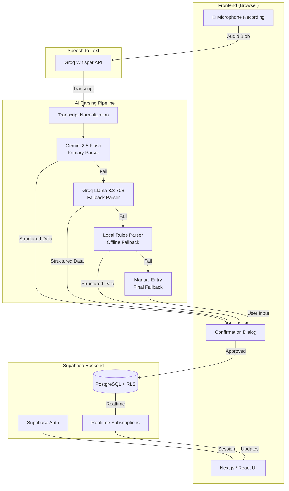

# ShopMind — System Architecture

## System Overview

ShopMind is a voice-first business operations assistant that converts spoken business updates into structured transaction records. The system is designed around a resilient AI parsing pipeline with multiple fallback layers, ensuring data extraction succeeds regardless of network conditions or API availability.

**Core Design Principles:**
- Voice-first, language-agnostic input
- Graceful degradation through fallback chain
- Zero-cost operation on free tiers
- Row-level data isolation per user
- Real-time synchronization across devices

---

## Architecture Diagram



### ASCII Fallback Diagram

```
┌─────────────────────────────────────────────────────────────────────┐
│                         BROWSER CLIENT                               │
│  ┌──────────┐    ┌──────────────┐    ┌────────────────────┐        │
│  │   Mic    │───▶│  Audio Blob  │───▶│  Send to Groq API  │        │
│  └──────────┘    └──────────────┘    └─────────┬──────────┘        │
└─────────────────────────────────────────────────┼────────────────────┘
                                                  │
                                                  ▼
┌─────────────────────────────────────────────────────────────────────┐
│                      SPEECH-TO-TEXT LAYER                             │
│                    Groq Whisper API (STT)                             │
└─────────────────────────────────┬───────────────────────────────────┘
                                  │ Transcript
                                  ▼
┌─────────────────────────────────────────────────────────────────────┐
│                      AI PARSING PIPELINE                              │
│                                                                       │
│  ┌─────────────────┐    ┌──────────────────┐    ┌───────────────┐  │
│  │ Transcript Norm. │───▶│ Gemini 2.5 Flash │───▶│ Structured TX │  │
│  └─────────────────┘    └────────┬─────────┘    └───────────────┘  │
│                                  │ (on failure)                       │
│                                  ▼                                    │
│                         ┌──────────────────┐                         │
│                         │ Groq Llama 3.3   │                         │
│                         └────────┬─────────┘                         │
│                                  │ (on failure)                       │
│                                  ▼                                    │
│                         ┌──────────────────┐                         │
│                         │ Local Rules      │                         │
│                         └────────┬─────────┘                         │
│                                  │ (on failure)                       │
│                                  ▼                                    │
│                         ┌──────────────────┐                         │
│                         │ Manual Entry     │                         │
│                         └──────────────────┘                         │
└─────────────────────────────────────────────────────────────────────┘
                                  │
                                  ▼
┌─────────────────────────────────────────────────────────────────────┐
│                      USER CONFIRMATION                                │
│              Review extracted data → Approve / Edit                   │
└─────────────────────────────────┬───────────────────────────────────┘
                                  │
                                  ▼
┌─────────────────────────────────────────────────────────────────────┐
│                      SUPABASE BACKEND                                 │
│  ┌──────────┐    ┌──────────────────┐    ┌────────────────────┐    │
│  │   Auth   │    │  PostgreSQL + RLS │    │  Realtime Engine   │    │
│  └──────────┘    └──────────────────┘    └────────────────────┘    │
└─────────────────────────────────────────────────────────────────────┘
```

---

## Component Descriptions

### Frontend (Next.js / React)

| Aspect | Details |
|--------|---------|
| Framework | Next.js (App Router) with React |
| Language | TypeScript |
| Styling | Tailwind CSS |
| Voice Input | Web Audio API / MediaRecorder |
| State | React hooks + Supabase Realtime subscriptions |

**Responsibilities:**
- Browser-based voice recording and audio capture
- Displaying transcription results and parsed transactions
- User confirmation/editing interface before save
- Real-time dashboard updates via Supabase subscriptions
- Auth flow (sign up, sign in, session management)

### Backend / API

ShopMind uses a **serverless API** architecture via Next.js API routes (or Route Handlers in App Router). There is no standalone backend server.

| Aspect | Details |
|--------|---------|
| Runtime | Next.js API Routes / Route Handlers |
| Auth Verification | Supabase server-side auth helpers |
| API Keys | Stored in environment variables, never exposed to client |

**Responsibilities:**
- Proxy requests to Groq and Gemini APIs (keeping keys server-side)
- Validate and sanitize parsed transaction data
- Orchestrate the fallback parsing pipeline
- Handle error responses and logging

### AI Parsing Pipeline

The pipeline implements a **chain-of-responsibility** pattern where each parser implements the `TransactionParser` interface:

```typescript
interface TransactionParser {
  name: string;
  parse(transcript: string, context?: ParserContext): Promise<ParseResult>;
  isAvailable(): Promise<boolean>;
}
```

| Parser | Provider | Cost | Latency | Accuracy |
|--------|----------|------|---------|----------|
| Gemini 2.5 Flash | Google AI | Free tier | ~1-2s | High |
| Groq Llama 3.3 70B | Groq | Free tier | ~1-3s | Medium-High |
| Local Rules Parser | Local regex/rules | $0 | <100ms | Medium |
| Manual Entry | User input | $0 | N/A | Perfect |

**Fallback Logic:**
1. Try primary parser (Gemini 2.5 Flash)
2. On failure/timeout → try Groq Llama 3.3 70B
3. On failure/timeout → try Local Rules Parser
4. On failure → present Manual Entry form

### Database (Supabase / PostgreSQL)

| Aspect | Details |
|--------|---------|
| Engine | PostgreSQL 15 (Supabase-managed) |
| Security | Row-Level Security (RLS) policies |
| Real-time | Supabase Realtime (WebSocket subscriptions) |
| Storage | Supabase Storage (for audio files, optional) |

**Key Tables:**
- `users` — User profiles and preferences
- `transactions` — Business transactions (sales, expenses, inventory)
- `audio_logs` — Optional audio recording metadata
- `categories` — Transaction categories per user

**RLS Policy Pattern:**
```sql
-- Users can only access their own data
CREATE POLICY "Users access own transactions"
ON transactions FOR ALL
USING (auth.uid() = user_id);
```

### Authentication (Supabase Auth)

| Aspect | Details |
|--------|---------|
| Provider | Supabase Auth |
| Methods | Email/Password, Magic Link, OAuth (Google) |
| Session | JWT-based, stored in httpOnly cookies |
| RLS Integration | `auth.uid()` used in all RLS policies |

---

## Data Flow

### Primary Flow (Happy Path)

```
1. User taps "Record" → Browser captures audio via MediaRecorder API
2. Audio blob sent to Next.js API route
3. API route forwards audio to Groq Whisper → receives transcript
4. Transcript normalized (whitespace, punctuation cleanup)
5. Normalized transcript sent to Gemini 2.5 Flash with extraction prompt
6. Gemini returns structured JSON (type, amount, description, category, date)
7. Structured data returned to frontend
8. User reviews and confirms the transaction
9. Confirmed transaction inserted into Supabase (PostgreSQL)
10. Realtime subscription pushes update to any open dashboard
```

### Fallback Flow

```
Step 5 fails (Gemini timeout/error/rate limit):
  → Try Groq Llama 3.3 70B with same prompt
  → If that fails → Local Rules Parser (regex-based extraction)
  → If that fails → Show Manual Entry form to user
```

---

## Component Interactions and Dependencies

```
┌──────────────┐         ┌──────────────┐
│   Frontend   │◀───────▶│ Supabase Auth│
│  (Next.js)   │         └──────────────┘
└──────┬───────┘                │
       │                        │ JWT validation
       ▼                        ▼
┌──────────────┐         ┌──────────────┐
│  API Routes  │────────▶│  Supabase DB │
└──────┬───────┘         └──────┬───────┘
       │                        │
       ▼                        ▼
┌──────────────┐         ┌──────────────┐
│  Groq API    │         │   Realtime   │
│  (Whisper +  │         │   Engine     │
│   Llama)     │         └──────────────┘
└──────────────┘
       │
       ▼
┌──────────────┐
│  Gemini API  │
└──────────────┘
```

**Dependency Map:**

| Component | Depends On | Failure Impact |
|-----------|-----------|----------------|
| Frontend | Supabase Auth, API Routes | Cannot operate without auth |
| API Routes | Groq API, Gemini API | Falls back through parser chain |
| STT (Whisper) | Groq API | No transcription; manual input only |
| Primary Parser | Gemini API | Falls back to Llama |
| Fallback Parser | Groq API | Falls back to Rules Parser |
| Rules Parser | None (local) | Falls back to Manual Entry |
| Database | Supabase | App non-functional without DB |
| Realtime | Supabase | Dashboard won't auto-update |

---

## Technology Stack Details

### Runtime & Language
- **TypeScript** — End-to-end type safety
- **Node.js 18+** — Server runtime via Next.js

### Frontend
- **Next.js 14+** — App Router, SSR, API routes
- **React 18+** — UI components
- **Tailwind CSS** — Utility-first styling
- **Web Audio API** — Browser audio recording

### Backend Services
- **Supabase** — PostgreSQL, Auth, Realtime, Storage
- **Groq API** — Whisper STT + Llama 3.3 70B inference
- **Google AI (Gemini)** — Gemini 2.5 Flash for structured extraction
- **Ollama** (optional) — Local LLM for development/offline use

### DevOps & Tooling
- **Vercel** — Frontend deployment (free tier)
- **Supabase Cloud** — Database hosting (free tier)
- **pnpm/npm** — Package management
- **ESLint + Prettier** — Code quality

---

## Deployment Architecture

```
┌─────────────────────────────────────────────────────────────┐
│                        VERCEL                                 │
│  ┌───────────────────────────────────────────────────────┐  │
│  │              Next.js Application                       │  │
│  │  ┌─────────────┐  ┌─────────────┐  ┌─────────────┐  │  │
│  │  │  Static     │  │  SSR Pages  │  │  API Routes  │  │  │
│  │  │  Assets     │  │  (Edge/Node)│  │  (Serverless)│  │  │
│  │  └─────────────┘  └─────────────┘  └─────────────┘  │  │
│  └───────────────────────────────────────────────────────┘  │
└──────────────────────────────┬──────────────────────────────┘
                               │
            ┌──────────────────┼──────────────────┐
            ▼                  ▼                  ▼
    ┌──────────────┐  ┌──────────────┐  ┌──────────────┐
    │  Supabase    │  │  Groq API    │  │  Gemini API  │
    │  (Postgres,  │  │  (Whisper,   │  │  (2.5 Flash) │
    │   Auth, RT)  │  │   Llama)     │  │              │
    └──────────────┘  └──────────────┘  └──────────────┘
```

### Environment Strategy

| Environment | Purpose | URL |
|-------------|---------|-----|
| Development | Local dev with hot reload | `localhost:3000` |
| Preview | PR previews on Vercel | `*.vercel.app` |
| Production | Live application | Custom domain |

### Cost Profile (Free Tiers)

| Service | Free Tier Limits |
|---------|-----------------|
| Vercel | 100GB bandwidth, serverless functions |
| Supabase | 500MB DB, 50K auth users, 2GB storage |
| Groq | Rate-limited API access |
| Gemini | 15 RPM, 1M tokens/day |

---

## Scalability Considerations

### Current Design (Free Tier)

The system is designed for **single-user to small-team** usage on free tiers:
- Supabase handles DB scaling automatically within tier limits
- Serverless API routes scale horizontally on Vercel
- AI API rate limits are the primary bottleneck

### Scaling Strategies

| Bottleneck | Solution |
|-----------|----------|
| AI API rate limits | Queue requests, batch processing, upgrade to paid tier |
| STT throughput | Client-side chunking, parallel requests |
| Database connections | Supabase connection pooling (PgBouncer) |
| Realtime connections | Supabase handles up to 200 concurrent (free) |
| Audio storage | Supabase Storage with CDN, or external S3 |

### Future Scaling Path

1. **Vertical** — Upgrade Supabase/Groq/Gemini to paid tiers
2. **Caching** — Cache frequent parser results for common phrases
3. **Edge** — Deploy API routes at edge for lower latency
4. **Queue** — Add job queue (e.g., Inngest, QStash) for async parsing
5. **Self-hosted LLM** — Ollama/vLLM for unlimited local inference
6. **Multi-tenant** — Schema-per-tenant or shared with RLS (current approach)

### Reliability Patterns

- **Fallback Chain** — No single AI provider failure blocks the user
- **Optimistic UI** — Show pending state while awaiting confirmation
- **Retry with Backoff** — Transient API failures retried automatically
- **Offline Rules** — Local parser works without any network connection
- **Idempotent Writes** — Duplicate submission protection via unique constraints
