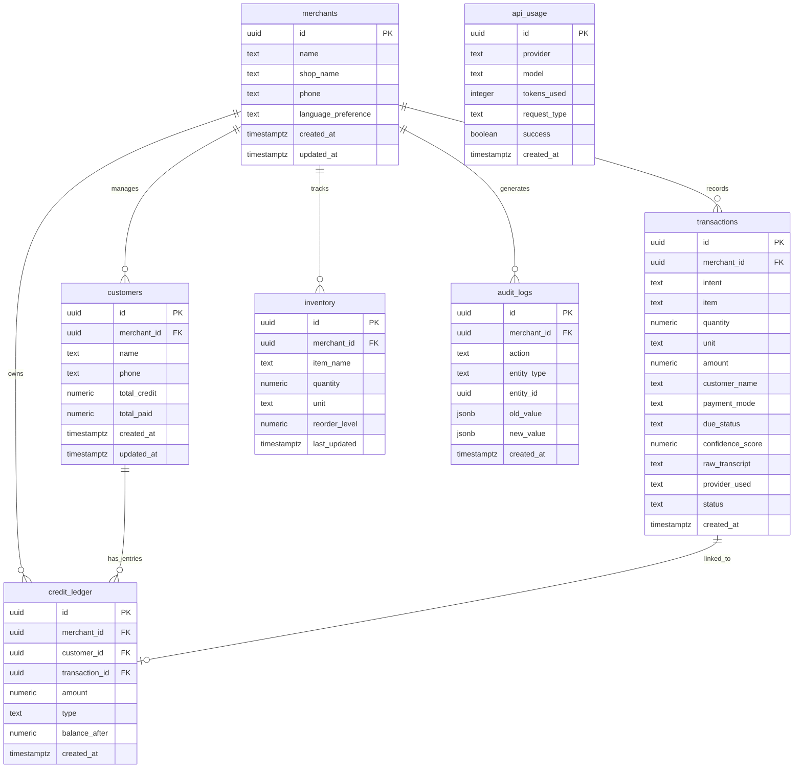

# ShopMind Database Schema

## Overview

ShopMind uses **Supabase** (managed PostgreSQL) as its primary database. The schema is designed to support voice-driven transaction logging for small merchants, with full audit trails, credit tracking, and AI provider usage monitoring.

- **Database**: PostgreSQL 15+ (via Supabase)
- **Authentication**: Supabase Auth (JWT-based)
- **Security**: Row-Level Security (RLS) enabled on all tables
- **Extensions**: `uuid-ossp`, `pgcrypto`

---

## Entity-Relationship Diagram



---

## Table Definitions

### `merchants`

The core identity table. Each merchant represents a shop owner using ShopMind.

| Column | Type | Constraints | Description |
|--------|------|-------------|-------------|
| `id` | `uuid` | PK, DEFAULT `gen_random_uuid()` | Unique merchant identifier |
| `name` | `text` | NOT NULL | Merchant's full name |
| `shop_name` | `text` | NOT NULL | Name of the shop/business |
| `phone` | `text` | NOT NULL, UNIQUE | Phone number (used for login) |
| `language_preference` | `text` | NOT NULL, DEFAULT `'en'` | Preferred language (en, hi, te, ta, etc.) |
| `created_at` | `timestamptz` | NOT NULL, DEFAULT `now()` | Account creation timestamp |
| `updated_at` | `timestamptz` | NOT NULL, DEFAULT `now()` | Last profile update timestamp |

```sql
CREATE TABLE merchants (
    id uuid PRIMARY KEY DEFAULT gen_random_uuid(),
    name text NOT NULL,
    shop_name text NOT NULL,
    phone text NOT NULL UNIQUE,
    language_preference text NOT NULL DEFAULT 'en',
    created_at timestamptz NOT NULL DEFAULT now(),
    updated_at timestamptz NOT NULL DEFAULT now()
);
```

---

### `transactions`

Records every voice-parsed transaction. Each entry represents a sale, purchase, credit, or payment event.

| Column | Type | Constraints | Description |
|--------|------|-------------|-------------|
| `id` | `uuid` | PK, DEFAULT `gen_random_uuid()` | Unique transaction identifier |
| `merchant_id` | `uuid` | NOT NULL, FK → `merchants.id` | Owning merchant |
| `intent` | `text` | NOT NULL | Parsed intent (sale, purchase, credit_given, credit_received, expense) |
| `item` | `text` | | Item name involved in the transaction |
| `quantity` | `numeric(10,2)` | | Quantity of items |
| `unit` | `text` | | Unit of measurement (kg, pieces, liters, etc.) |
| `amount` | `numeric(12,2)` | NOT NULL | Transaction amount |
| `customer_name` | `text` | | Customer name (if applicable) |
| `payment_mode` | `text` | | Payment method (cash, upi, card, credit) |
| `due_status` | `text` | DEFAULT `'none'` | Credit status (none, pending, partial, paid) |
| `confidence_score` | `numeric(3,2)` | | AI confidence score (0.00 - 1.00) |
| `raw_transcript` | `text` | | Original voice transcript |
| `provider_used` | `text` | | AI provider used (openai, gemini, local) |
| `status` | `text` | NOT NULL, DEFAULT `'pending'` | Transaction status (pending, confirmed, cancelled) |
| `created_at` | `timestamptz` | NOT NULL, DEFAULT `now()` | Transaction creation timestamp |

```sql
CREATE TABLE transactions (
    id uuid PRIMARY KEY DEFAULT gen_random_uuid(),
    merchant_id uuid NOT NULL REFERENCES merchants(id) ON DELETE CASCADE,
    intent text NOT NULL,
    item text,
    quantity numeric(10,2),
    unit text,
    amount numeric(12,2) NOT NULL,
    customer_name text,
    payment_mode text,
    due_status text DEFAULT 'none',
    confidence_score numeric(3,2),
    raw_transcript text,
    provider_used text,
    status text NOT NULL DEFAULT 'pending',
    created_at timestamptz NOT NULL DEFAULT now()
);
```


---

### `customers`

Tracks customers associated with each merchant, including their credit balances.

| Column | Type | Constraints | Description |
|--------|------|-------------|-------------|
| `id` | `uuid` | PK, DEFAULT `gen_random_uuid()` | Unique customer identifier |
| `merchant_id` | `uuid` | NOT NULL, FK → `merchants.id` | Owning merchant |
| `name` | `text` | NOT NULL | Customer's name |
| `phone` | `text` | | Customer's phone number |
| `total_credit` | `numeric(12,2)` | NOT NULL, DEFAULT `0` | Total outstanding credit |
| `total_paid` | `numeric(12,2)` | NOT NULL, DEFAULT `0` | Total amount paid back |
| `created_at` | `timestamptz` | NOT NULL, DEFAULT `now()` | Record creation timestamp |
| `updated_at` | `timestamptz` | NOT NULL, DEFAULT `now()` | Last update timestamp |

```sql
CREATE TABLE customers (
    id uuid PRIMARY KEY DEFAULT gen_random_uuid(),
    merchant_id uuid NOT NULL REFERENCES merchants(id) ON DELETE CASCADE,
    name text NOT NULL,
    phone text,
    total_credit numeric(12,2) NOT NULL DEFAULT 0,
    total_paid numeric(12,2) NOT NULL DEFAULT 0,
    created_at timestamptz NOT NULL DEFAULT now(),
    updated_at timestamptz NOT NULL DEFAULT now(),
    UNIQUE(merchant_id, phone)
);
```

---

### `inventory`

Tracks stock levels for each merchant's items.

| Column | Type | Constraints | Description |
|--------|------|-------------|-------------|
| `id` | `uuid` | PK, DEFAULT `gen_random_uuid()` | Unique inventory record ID |
| `merchant_id` | `uuid` | NOT NULL, FK → `merchants.id` | Owning merchant |
| `item_name` | `text` | NOT NULL | Name of the inventory item |
| `quantity` | `numeric(10,2)` | NOT NULL, DEFAULT `0` | Current stock quantity |
| `unit` | `text` | NOT NULL | Unit of measurement |
| `reorder_level` | `numeric(10,2)` | NOT NULL, DEFAULT `0` | Threshold for low-stock alerts |
| `last_updated` | `timestamptz` | NOT NULL, DEFAULT `now()` | Last stock update timestamp |

```sql
CREATE TABLE inventory (
    id uuid PRIMARY KEY DEFAULT gen_random_uuid(),
    merchant_id uuid NOT NULL REFERENCES merchants(id) ON DELETE CASCADE,
    item_name text NOT NULL,
    quantity numeric(10,2) NOT NULL DEFAULT 0,
    unit text NOT NULL,
    reorder_level numeric(10,2) NOT NULL DEFAULT 0,
    last_updated timestamptz NOT NULL DEFAULT now(),
    UNIQUE(merchant_id, item_name)
);
```

---

### `credit_ledger`

Immutable ledger tracking all credit/debit movements per customer.

| Column | Type | Constraints | Description |
|--------|------|-------------|-------------|
| `id` | `uuid` | PK, DEFAULT `gen_random_uuid()` | Unique ledger entry ID |
| `merchant_id` | `uuid` | NOT NULL, FK → `merchants.id` | Owning merchant |
| `customer_id` | `uuid` | NOT NULL, FK → `customers.id` | Associated customer |
| `transaction_id` | `uuid` | FK → `transactions.id` | Linked transaction (if any) |
| `amount` | `numeric(12,2)` | NOT NULL | Entry amount |
| `type` | `text` | NOT NULL, CHECK (`type` IN ('credit', 'debit')) | Entry type |
| `balance_after` | `numeric(12,2)` | NOT NULL | Running balance after this entry |
| `created_at` | `timestamptz` | NOT NULL, DEFAULT `now()` | Entry creation timestamp |

```sql
CREATE TABLE credit_ledger (
    id uuid PRIMARY KEY DEFAULT gen_random_uuid(),
    merchant_id uuid NOT NULL REFERENCES merchants(id) ON DELETE CASCADE,
    customer_id uuid NOT NULL REFERENCES customers(id) ON DELETE CASCADE,
    transaction_id uuid REFERENCES transactions(id) ON DELETE SET NULL,
    amount numeric(12,2) NOT NULL,
    type text NOT NULL CHECK (type IN ('credit', 'debit')),
    balance_after numeric(12,2) NOT NULL,
    created_at timestamptz NOT NULL DEFAULT now()
);
```

---

### `audit_logs`

Immutable audit trail for all significant data changes.

| Column | Type | Constraints | Description |
|--------|------|-------------|-------------|
| `id` | `uuid` | PK, DEFAULT `gen_random_uuid()` | Unique audit log ID |
| `merchant_id` | `uuid` | NOT NULL, FK → `merchants.id` | Merchant who performed the action |
| `action` | `text` | NOT NULL | Action performed (create, update, delete, confirm, cancel) |
| `entity_type` | `text` | NOT NULL | Entity type affected (transaction, customer, inventory) |
| `entity_id` | `uuid` | NOT NULL | ID of the affected entity |
| `old_value` | `jsonb` | | Previous state (for updates/deletes) |
| `new_value` | `jsonb` | | New state (for creates/updates) |
| `created_at` | `timestamptz` | NOT NULL, DEFAULT `now()` | Timestamp of the action |

```sql
CREATE TABLE audit_logs (
    id uuid PRIMARY KEY DEFAULT gen_random_uuid(),
    merchant_id uuid NOT NULL REFERENCES merchants(id) ON DELETE CASCADE,
    action text NOT NULL,
    entity_type text NOT NULL,
    entity_id uuid NOT NULL,
    old_value jsonb,
    new_value jsonb,
    created_at timestamptz NOT NULL DEFAULT now()
);
```

---

### `api_usage`

Tracks AI provider API calls for cost monitoring and provider health analysis.

| Column | Type | Constraints | Description |
|--------|------|-------------|-------------|
| `id` | `uuid` | PK, DEFAULT `gen_random_uuid()` | Unique usage record ID |
| `provider` | `text` | NOT NULL | Provider name (openai, gemini, deepgram, local) |
| `model` | `text` | NOT NULL | Model used (gpt-4o-mini, gemini-pro, whisper, etc.) |
| `tokens_used` | `integer` | NOT NULL, DEFAULT `0` | Tokens consumed in the request |
| `request_type` | `text` | NOT NULL | Request type (transcription, parsing, embedding) |
| `success` | `boolean` | NOT NULL, DEFAULT `true` | Whether the request succeeded |
| `created_at` | `timestamptz` | NOT NULL, DEFAULT `now()` | Request timestamp |

```sql
CREATE TABLE api_usage (
    id uuid PRIMARY KEY DEFAULT gen_random_uuid(),
    provider text NOT NULL,
    model text NOT NULL,
    tokens_used integer NOT NULL DEFAULT 0,
    request_type text NOT NULL,
    success boolean NOT NULL DEFAULT true,
    created_at timestamptz NOT NULL DEFAULT now()
);
```


---

## Indexes

```sql
-- Transactions: frequent queries by merchant and time
CREATE INDEX idx_transactions_merchant_id ON transactions(merchant_id);
CREATE INDEX idx_transactions_created_at ON transactions(created_at DESC);
CREATE INDEX idx_transactions_merchant_status ON transactions(merchant_id, status);

-- Customers: lookup by merchant and phone
CREATE INDEX idx_customers_merchant_id ON customers(merchant_id);
CREATE INDEX idx_customers_merchant_phone ON customers(merchant_id, phone);

-- Inventory: lookup by merchant and low-stock queries
CREATE INDEX idx_inventory_merchant_id ON inventory(merchant_id);
CREATE INDEX idx_inventory_low_stock ON inventory(merchant_id, quantity, reorder_level);

-- Credit Ledger: queries by customer and merchant
CREATE INDEX idx_credit_ledger_merchant_id ON credit_ledger(merchant_id);
CREATE INDEX idx_credit_ledger_customer_id ON credit_ledger(customer_id);
CREATE INDEX idx_credit_ledger_created_at ON credit_ledger(created_at DESC);

-- Audit Logs: queries by merchant, entity, and time
CREATE INDEX idx_audit_logs_merchant_id ON audit_logs(merchant_id);
CREATE INDEX idx_audit_logs_entity ON audit_logs(entity_type, entity_id);
CREATE INDEX idx_audit_logs_created_at ON audit_logs(created_at DESC);

-- API Usage: analytics queries by provider and time
CREATE INDEX idx_api_usage_provider ON api_usage(provider);
CREATE INDEX idx_api_usage_created_at ON api_usage(created_at DESC);
CREATE INDEX idx_api_usage_provider_success ON api_usage(provider, success);
```

---

## Row-Level Security (RLS) Policies

All tables have RLS enabled. Merchants can only access their own data.

```sql
-- Enable RLS on all tables
ALTER TABLE merchants ENABLE ROW LEVEL SECURITY;
ALTER TABLE transactions ENABLE ROW LEVEL SECURITY;
ALTER TABLE customers ENABLE ROW LEVEL SECURITY;
ALTER TABLE inventory ENABLE ROW LEVEL SECURITY;
ALTER TABLE credit_ledger ENABLE ROW LEVEL SECURITY;
ALTER TABLE audit_logs ENABLE ROW LEVEL SECURITY;
ALTER TABLE api_usage ENABLE ROW LEVEL SECURITY;

-- Merchants: users can only read/update their own profile
CREATE POLICY "merchants_select_own" ON merchants
    FOR SELECT USING (id = auth.uid());

CREATE POLICY "merchants_update_own" ON merchants
    FOR UPDATE USING (id = auth.uid());

-- Transactions: merchants can only access their own transactions
CREATE POLICY "transactions_select_own" ON transactions
    FOR SELECT USING (merchant_id = auth.uid());

CREATE POLICY "transactions_insert_own" ON transactions
    FOR INSERT WITH CHECK (merchant_id = auth.uid());

CREATE POLICY "transactions_update_own" ON transactions
    FOR UPDATE USING (merchant_id = auth.uid());

-- Customers: merchants can only access their own customers
CREATE POLICY "customers_select_own" ON customers
    FOR SELECT USING (merchant_id = auth.uid());

CREATE POLICY "customers_insert_own" ON customers
    FOR INSERT WITH CHECK (merchant_id = auth.uid());

CREATE POLICY "customers_update_own" ON customers
    FOR UPDATE USING (merchant_id = auth.uid());

-- Inventory: merchants can only access their own inventory
CREATE POLICY "inventory_select_own" ON inventory
    FOR SELECT USING (merchant_id = auth.uid());

CREATE POLICY "inventory_insert_own" ON inventory
    FOR INSERT WITH CHECK (merchant_id = auth.uid());

CREATE POLICY "inventory_update_own" ON inventory
    FOR UPDATE USING (merchant_id = auth.uid());

-- Credit Ledger: merchants can only access their own ledger entries
CREATE POLICY "credit_ledger_select_own" ON credit_ledger
    FOR SELECT USING (merchant_id = auth.uid());

CREATE POLICY "credit_ledger_insert_own" ON credit_ledger
    FOR INSERT WITH CHECK (merchant_id = auth.uid());

-- Audit Logs: merchants can only read their own logs (no update/delete)
CREATE POLICY "audit_logs_select_own" ON audit_logs
    FOR SELECT USING (merchant_id = auth.uid());

-- API Usage: admin-only access (service role)
CREATE POLICY "api_usage_admin_only" ON api_usage
    FOR SELECT USING (auth.jwt() ->> 'role' = 'admin');
```

---

## Data Relationships

### Core Relationships

- **Merchant → Transactions** (1:N): A merchant records many transactions via voice input. Each transaction belongs to exactly one merchant.

- **Merchant → Customers** (1:N): Each merchant has their own customer list. Customers are not shared across merchants.

- **Merchant → Inventory** (1:N): Each merchant independently tracks their own stock levels.

- **Customer → Credit Ledger** (1:N): Each customer has a chronological ledger of credit/debit entries representing money owed and payments received.

- **Transaction → Credit Ledger** (1:1, optional): A credit ledger entry may be linked to the transaction that created it, providing traceability.

### Data Flow

1. **Voice Input** → `transactions` (status: pending, confidence_score from AI)
2. **Merchant Confirms** → `transactions` (status: confirmed) → triggers `audit_logs` entry
3. **Credit Transaction** → `credit_ledger` entry created → `customers.total_credit` updated
4. **Sale Transaction** → `inventory.quantity` decremented (if item tracked)

### Cascade Rules

- Deleting a `merchant` cascades to all their `transactions`, `customers`, `inventory`, `credit_ledger`, and `audit_logs`.
- Deleting a `customer` cascades to their `credit_ledger` entries.
- Deleting a `transaction` sets `credit_ledger.transaction_id` to NULL (preserves financial records).

### Unique Constraints

- `merchants.phone` — One account per phone number
- `customers(merchant_id, phone)` — No duplicate customers per merchant
- `inventory(merchant_id, item_name)` — No duplicate items per merchant
