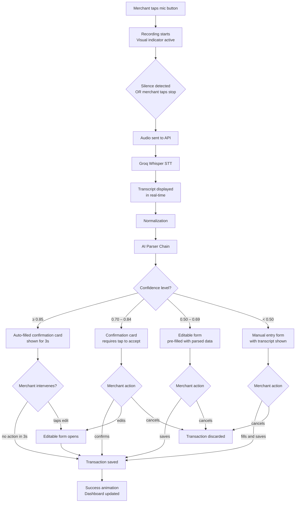
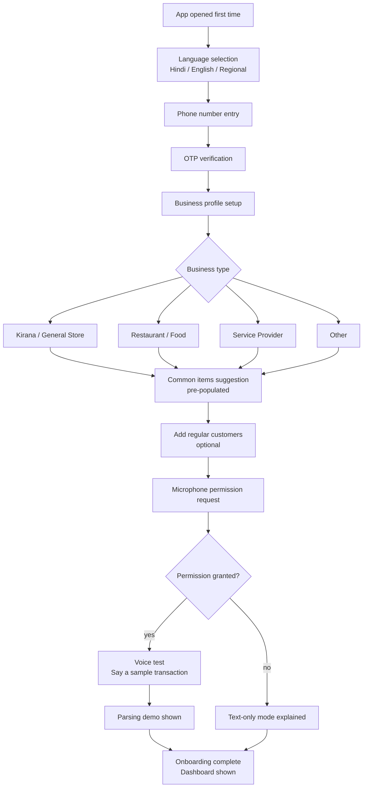
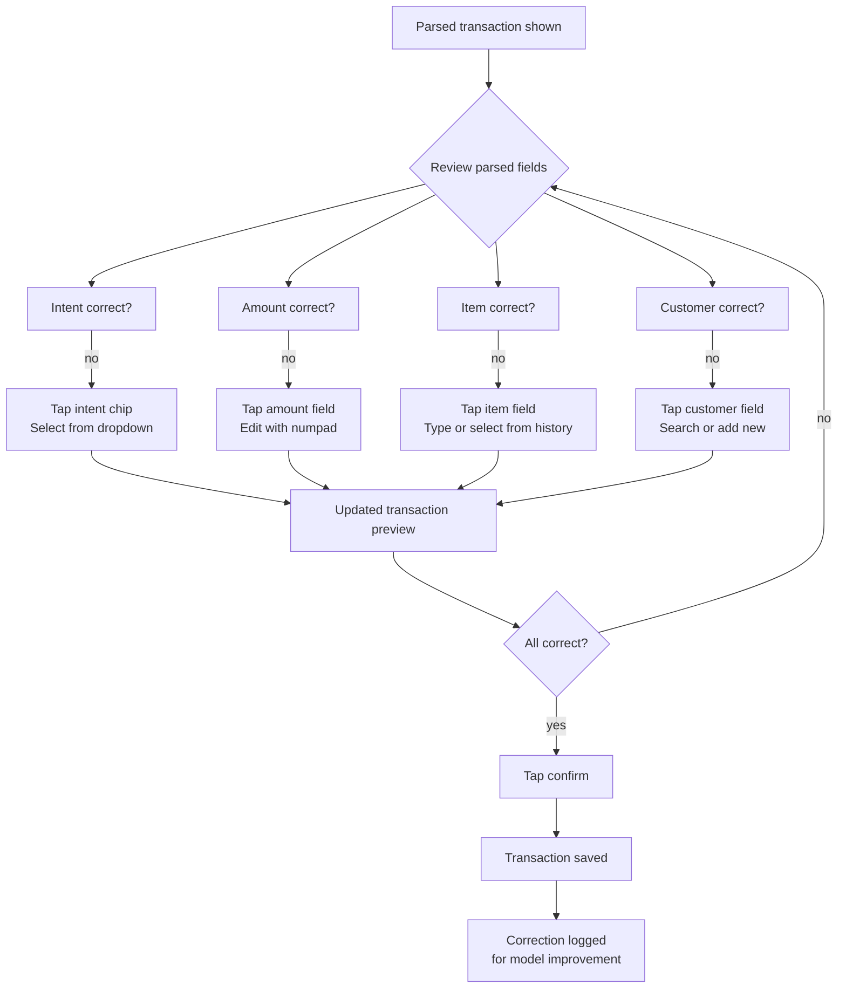
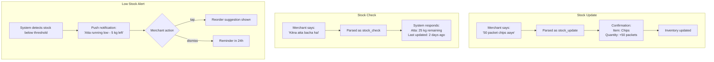
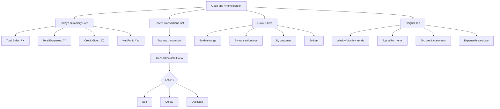
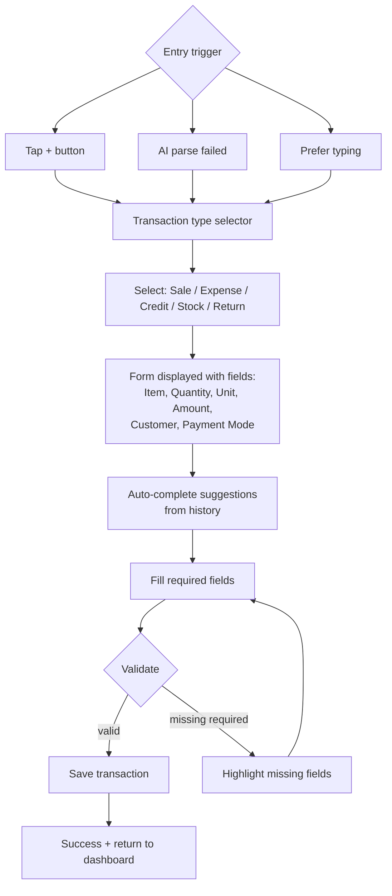
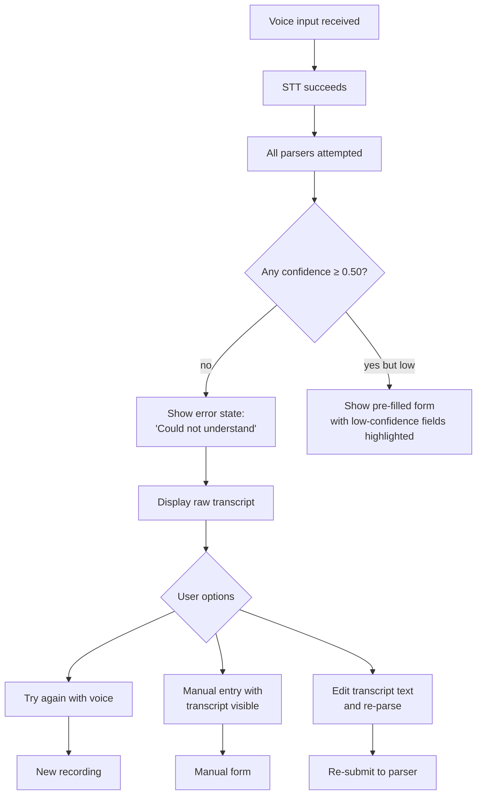
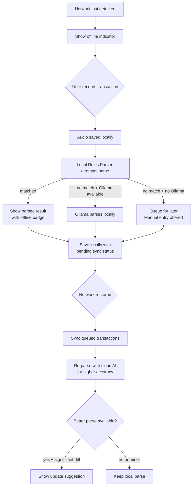
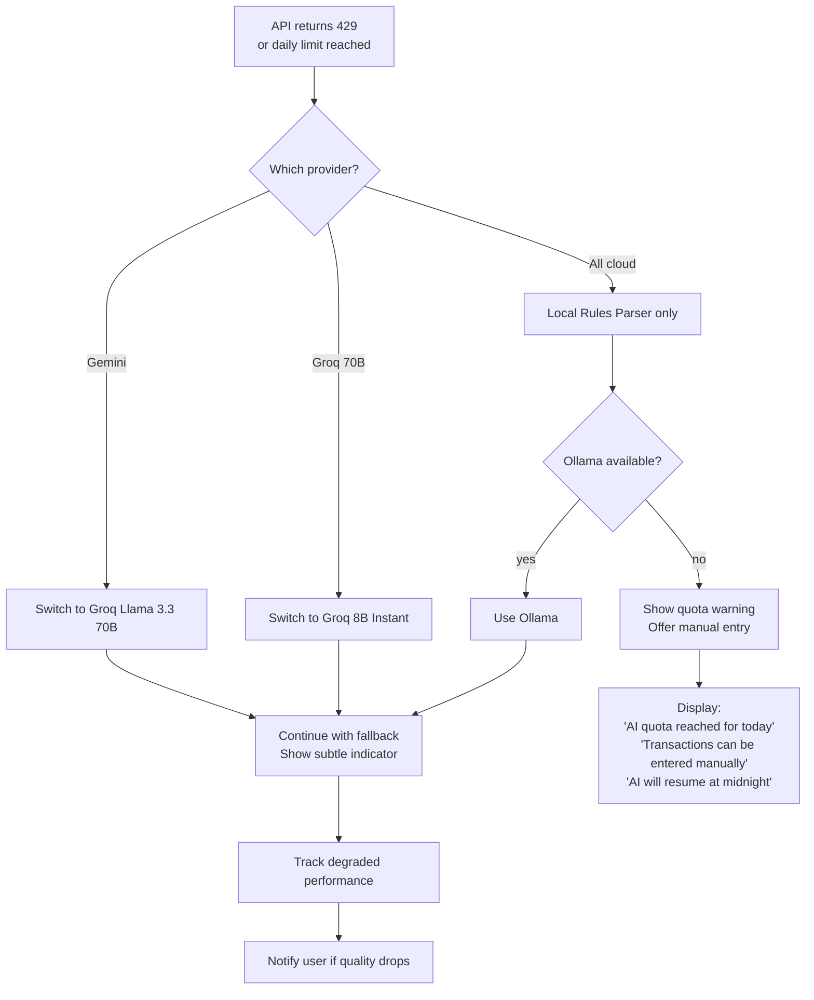

# User Flows — ShopMind

## Overview

ShopMind is a voice-first transaction management app for Indian small business merchants (kirana stores, general stores, service providers). The primary interaction model is:

1. Merchant speaks a transaction in natural language
2. AI parses the voice into structured data
3. Merchant confirms or corrects
4. Transaction is saved and reflected in dashboard

This document maps all primary flows, error states, and edge cases.

---

## Primary Flows

### Flow 1: Voice Transaction Recording

The core flow — merchant records a transaction by speaking.

---

### Flow 2: User Registration & Onboarding

---

### Flow 3: Transaction Confirmation & Correction

---

### Flow 4: Credit Management

```mermaid
flowchart TD
    subgraph GiveCredit["Give Credit"]
        A1[Merchant says:<br/>'Sharma ji ko 500 udhar diya'] --> B1[Parsed as credit_given]
        B1 --> C1[Confirmation card:<br/>Customer: Sharma ji<br/>Amount: ₹500<br/>Status: Due]
        C1 --> D1[Confirmed & saved]
        D1 --> E1[Customer credit balance updated]
    end
    
    subgraph ReceivePayment["Receive Payment"]
        A2[Merchant says:<br/>'Sharma ji ne 300 diye'] --> B2[Parsed as credit_received]
        B2 --> C2[System shows:<br/>Sharma ji owes ₹500<br/>Payment: ₹300<br/>Remaining: ₹200]
        C2 --> D2[Confirmed & saved]
        D2 --> E2[Credit balance reduced]
    end
    
    subgraph CreditView["Credit Dashboard"]
        F[Tap Credits tab] --> G[List of all customers with dues]
        G --> H[Tap customer name]
        H --> I[Full credit history<br/>with timeline]
        I --> J[Option: Send reminder<br/>via WhatsApp/SMS]
    end
```

---

### Flow 5: Inventory Check & Update

---

### Flow 6: Dashboard Viewing

---

### Flow 7: Manual Entry Fallback

---

## Error Flows

### AI Parsing Failure

### Network Connectivity Loss

### Quota Exhaustion

---

## Edge Cases

| Scenario | Handling |
|----------|----------|
| **Merchant speaks too fast** | Show "speak slower" hint if STT confidence is low |
| **Background noise** | Noise suppression via Web Audio API; retry prompt if transcript garbled |
| **Multiple transactions in one utterance** | Split detection; show each as separate confirmation card |
| **Ambiguous amount** | "sau" could be 100 or part of a name; use context + confirmation |
| **Unknown customer name** | Offer to add as new customer or select from similar names |
| **Duplicate transaction** | Detect if same transaction within 30s; ask "Did you mean to add another?" |
| **Currency confusion** | Default to INR; flag if amount seems unreasonable for item |
| **Mixed languages mid-sentence** | Normalizer handles code-switching; parser trained on Hinglish |
| **Very large amounts** | Confirm amounts > ₹10,000 with extra verification step |
| **Zero quantity or amount** | Reject and ask for clarification |
| **Item not in inventory** | Allow and suggest adding to inventory |
| **Partial utterance (cut off)** | Show what was captured; offer to re-record or complete manually |

---

## User Personas

### Persona 1: Ramesh — Kirana Store Owner

| Attribute | Detail |
|-----------|--------|
| **Age** | 45 |
| **Location** | Tier-2 city, Uttar Pradesh |
| **Language** | Hindi primarily, some English numbers |
| **Tech comfort** | Low — uses WhatsApp and YouTube |
| **Business** | General store, 50-100 transactions/day |
| **Pain points** | Forgets to note credit; paper registers messy; can't track profit |
| **Key need** | Voice-first, minimal typing, Hindi interface |
| **Device** | Budget Android phone (2GB RAM) |

### Persona 2: Priya — Salon Owner

| Attribute | Detail |
|-----------|--------|
| **Age** | 32 |
| **Location** | Metro city suburb |
| **Language** | Hinglish |
| **Tech comfort** | Medium — uses Instagram for business |
| **Business** | Beauty salon, 15-25 appointments/day |
| **Pain points** | Tracking service revenue vs. product sales; managing credit for regular clients |
| **Key need** | Quick entry between appointments; credit tracking per customer |
| **Device** | Mid-range Android |

### Persona 3: Arjun — Chai Stall Operator

| Attribute | Detail |
|-----------|--------|
| **Age** | 28 |
| **Location** | Tier-3 town |
| **Language** | Hindi with local dialect |
| **Tech comfort** | Low-medium |
| **Business** | Tea and snacks, 200+ micro-transactions/day |
| **Pain points** | Too many small transactions to track manually; needs batch entry |
| **Key need** | Ultra-fast recording (< 5s per transaction); daily summary |
| **Device** | Budget Android, sometimes poor connectivity |

### Persona 4: Deepa — Wholesale Supplier

| Attribute | Detail |
|-----------|--------|
| **Age** | 50 |
| **Location** | Mandi / wholesale market |
| **Language** | Hindi |
| **Tech comfort** | Very low — son helps with phone |
| **Business** | Wholesale grains, 20-30 large transactions/day |
| **Pain points** | Complex credit chains; large amounts; needs detailed records for tax |
| **Key need** | Accurate amounts for large transactions; credit management; exportable records |
| **Device** | Basic smartphone, prefers voice over typing |
