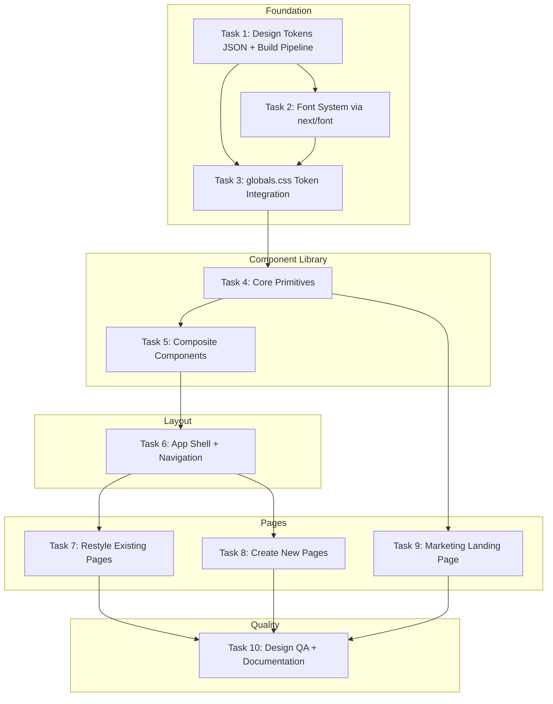

# ShopMind — Design Integration Plan (Revised)

> **Document:** `new_Design_plan.md`  
> **Created:** 2026-07-06  
> **Status:** Approved  
> **Approach:** Selective Merge — Design.md (visual) + DESIGN_SYSTEM.md (product behavior)

---

## Document Hierarchy

```
DESIGN.md              ← Design philosophy, brand, visual language
    ↓
DESIGN_SYSTEM.md       ← Components, tokens, accessibility, interaction rules
    ↓
STYLE_GUIDE.md         ← Practical implementation examples, component usage, do/don't
```

DESIGN.md is the creative north star. DESIGN_SYSTEM.md is the product system of record. STYLE_GUIDE.md is a practical companion — never the canonical document.

---

## 1. Introduction

This plan integrates `Design.md` into the ShopMind codebase via a **selective merge** approach:

- **Design.md** drives: visual language, brand personality, editorial aesthetic, colors, typography hierarchy, elevation, motion philosophy.
- **DESIGN_SYSTEM.md** governs: component behavior, accessibility, multilingual support, voice-first UX, responsive rules, interaction patterns.
- **Where they conflict**: DESIGN_SYSTEM.md wins for product behavior; Design.md wins for visuals.

### Hard Constraints (non-negotiable)
- ✅ Hindi/Telugu support (Noto Sans Devanagari / Noto Sans Telugu)
- ✅ 48px+ touch targets
- ✅ Low-literacy visual cues (icons, color-coding, minimal text)
- ✅ WCAG AA accessibility
- ✅ Voice-first interaction patterns
- ✅ Mobile-first usability

### Scope
- Foundation + full restyle of all existing pages
- Create missing pages (Transactions, Khata, Settings, Analytics)
- Premium marketing/landing page
- Unified design language across the product

### Font Decision
| Role | Font | Usage |
|------|------|-------|
| Primary UI | **Figtree** (400–700) | All application text, headings, forms |
| Editorial Serif (configurable) | **Fraunces** (default) | Hero headings, marketing pages, large quotes only |
| Hindi/Devanagari | **Noto Sans Devanagari** | Auto-switch via `:lang(hi)` |
| Telugu | **Noto Sans Telugu** | Auto-switch via `:lang(te)` |

Serif alternatives: Newsreader, Instrument Serif, Cormorant Garamond — configurable via token.

---

## 2. Component Inventory & Audit

Before any rewriting, audit all existing components to determine disposition.

| Component | Status | Disposition |
|-----------|--------|-------------|
| `ui/Button` | Exists | **Refactor** — update tokens, add cursor-pointer |
| `ui/Input` | Missing | **Create** — new primitive |
| `ui/Card` | Missing | **Create** — new primitive |
| `ui/Modal` | Missing | **Create** (Task 5) |
| `ui/Drawer` | Missing | **Create** (Task 5 — mobile menu) |
| `ui/Dropdown` | Missing | **Create** (Task 5) |
| `ui/Toast` | Missing | **Create** (Task 5) |
| `ui/Badge` | Missing | **Create** (Task 5) |
| `ui/Tag` | Missing | **Create** (Task 5) |
| `ui/Avatar` | Missing | **Create** (Task 5) |
| `ui/Skeleton` | Missing | **Create** (Task 5) |
| `layout/BottomNav` | Exists | **Refactor** — new tokens |
| `voice/VoiceRecordButton` | Exists | **Refactor** — new tokens |
| `transaction/ConfirmationCard` | Exists | **Refactor** — replace emoji with Lucide icons, new tokens |

---

## 3. Design Tokens JSON (Single Source of Truth for Implementation)

### Token Structure
```
tokens/
├── colors.json          # Semantic color tokens
├── spacing.json         # 4px-grid spacing scale
├── radius.json          # Border radius scale
├── typography.json      # Font families, sizes, weights, line heights
├── shadow.json          # Elevation/shadow tokens
├── motion.json          # Duration, easing, named transitions
└── z-index.json         # Layer management
```

### Semantic Color Tokens (NOT raw colors)
```json
{
  "color": {
    "primary": "#2D6A4F",
    "primary-hover": "#1B4332",
    "primary-muted": "#D8F3DC",
    "secondary": "#111111",

    "success": "#2ECC71",
    "warning": "#F4B400",
    "danger": "#E53935",
    "info": "#2196F3",

    "income": "#2ECC71",
    "expense": "#E53935",
    "credit-given": "#F4B400",
    "credit-received": "#2196F3",

    "voice-idle": "#2D6A4F",
    "voice-active": "#E53935",
    "voice-processing": "#1B4332",
    "recording": "#E53935",

    "bg": "#F7F7F5",
    "surface": "#FFFFFF",
    "text-primary": "#111111",
    "text-secondary": "#666666",
    "text-muted": "#8B8B8B",
    "border": "#E8E8E8",
    "divider": "#ECECEC",

    "dark-bg": "#0E0E10",
    "dark-surface": "#18181B",
    "dark-card": "#202024",
    "dark-text": "#F5F5F5",
    "dark-text-secondary": "#BBBBBB",
    "dark-border": "rgba(255,255,255,0.08)"
  }
}
```

### Motion Tokens
```json
{
  "motion": {
    "duration": {
      "fast": "150ms",
      "normal": "250ms",
      "slow": "400ms"
    },
    "easing": {
      "standard": "cubic-bezier(0.4, 0, 0.2, 1)",
      "decelerate": "cubic-bezier(0, 0, 0.2, 1)",
      "accelerate": "cubic-bezier(0.4, 0, 1, 1)"
    },
    "transitions": {
      "page-transition": "300ms cubic-bezier(0, 0, 0.2, 1)",
      "card-hover": "200ms cubic-bezier(0.4, 0, 0.2, 1)",
      "button-press": "150ms cubic-bezier(0, 0, 0.2, 1)",
      "modal": "300ms cubic-bezier(0, 0, 0.2, 1)",
      "drawer": "350ms cubic-bezier(0, 0, 0.2, 1)",
      "tooltip": "150ms cubic-bezier(0.4, 0, 0.2, 1)",
      "toast": "250ms cubic-bezier(0, 0, 0.2, 1)"
    }
  }
}
```

### Generation Pipeline
Tokens JSON → build script (`scripts/build-tokens.ts`) → generates:
- `src/styles/tokens.css` (CSS custom properties)
- Tailwind v4 theme extensions (via `@theme`)
- (Future: Figma tokens, Storybook args)

---

## 4. Performance Budget

| Metric | Target |
|--------|--------|
| Lighthouse Score | 95+ |
| Largest Contentful Paint (LCP) | < 2.5s |
| Interaction to Next Paint (INP) | < 200ms |
| Cumulative Layout Shift (CLS) | < 0.1 |
| JS Bundle (initial) | < 100kB gzipped |
| CSS Bundle | < 20kB gzipped |
| Font Loading | `next/font` self-hosted, `display: swap` |
| Image Optimization | `next/image` with WebP, lazy loading |
| Code Splitting | Route-based via Next.js App Router |
| Tree Shaking | Lucide icons imported individually |

---

## 5. AI Coding Rules

```markdown
## Implementation Rules (for AI agents and developers)

- Never hardcode colors — always use semantic design tokens
- Never hardcode spacing — always use spacing tokens
- Always use design tokens from `tokens/*.json` / CSS variables
- Never bypass the component library — compose from primitives
- Never create duplicate components — extend or compose existing ones
- Prefer composition over inheritance
- Maintain accessibility on every component
- No inline styles unless dynamically computed
- All new components must be documented in STYLE_GUIDE.md
- Every new component must support dark mode
- Every component must be responsive (375px → 1440px)
- Every interactive element must be keyboard accessible
- Every interactive element must have `cursor-pointer`
- Every form input must have an associated label
- Every image must have alt text
- Never use emoji as UI icons — use Lucide SVGs
- Respect `prefers-reduced-motion`
- Use semantic HTML elements
```

---

## 6. Task Breakdown (Foundation → Primitives → Composites → Layouts → Pages)

### Task 1: Design Tokens JSON & Build Pipeline

**Objective:** Create the `tokens/` directory with all JSON token files and a build script that generates `globals.css` from them.

**Implementation guidance:**
- Create `tokens/colors.json`, `spacing.json`, `radius.json`, `typography.json`, `shadow.json`, `motion.json`, `z-index.json`
- Build script: `scripts/build-tokens.ts` (TypeScript, runs via `tsx`)
- Output: generates the `:root` and `.dark` / `[data-theme="dark"]` blocks in a `src/styles/tokens.css` partial imported by `globals.css`
- Wire into `package.json` as `"tokens": "tsx scripts/build-tokens.ts"`
- Include the AI coding rules as `docs/AI_CODING_RULES.md`

**Test requirements:**
- Script runs without errors; output CSS matches expected token count
- Validate all color tokens pass WCAG AA contrast against their intended background

**Demo:** Running `npm run tokens` regenerates CSS; modifying a JSON value propagates to the app.

---

### Task 2: Font System via `next/font`

**Objective:** Load Figtree, Fraunces (configurable serif), Noto Sans Devanagari, and Noto Sans Telugu via `next/font/google`; expose as CSS variables; remove render-blocking `@import url(...)`.

**Implementation guidance:**
- In `src/app/layout.tsx`: import fonts, attach CSS variable classes to `<html>`
- Expose `--font-body`, `--font-serif`, `--font-deva`, `--font-telugu`
- In `globals.css`: `font-family: var(--font-body)` as base; `:lang(hi)` switches to `var(--font-deva)`, `:lang(te)` to `var(--font-telugu)`
- Delete the `@import url('https://fonts.googleapis.com/...')` line
- `typography.json` token includes `serif-family` as configurable (default: Fraunces)

**Test requirements:**
- `next build` succeeds; grep confirms no `@import url` in CSS
- Body renders in Figtree; setting `lang="hi"` on a wrapper switches to Noto Sans Devanagari

**Demo:** App loads fonts with zero render-blocking requests; serif available via `--font-serif` variable.

---

### Task 3: Refactor `globals.css` to Consume Tokens

**Objective:** Replace all hardcoded CSS custom properties with values generated from `tokens/*.json`; add motion tokens, z-index tokens, and `:lang()` rules; preserve all accessibility utilities.

**Implementation guidance:**
- Import generated `src/styles/tokens.css` partial
- Keep: `:focus-visible`, `@media (prefers-reduced-motion)`, `.touch-target`, `.animate-recording-pulse`, `.animate-card-enter`, `.btn-press`
- Update `.tx-*` classes to use semantic tokens (`--color-income`, `--color-expense`, etc.)
- Add named motion utilities: `.transition-card-hover`, `.transition-button-press`, `.transition-modal`, etc.
- Add z-index scale: `z-base`, `z-dropdown`, `z-sticky`, `z-modal`, `z-toast`

**Test requirements:**
- Visual: app renders in new green/warm palette, light + dark
- Contrast: `#2D6A4F` on `#FFFFFF` ≥ 4.5:1; `#111111` on `#F7F7F5` ≥ 4.5:1
- No CSS compilation errors

**Demo:** Whole app recolors to the warm/green palette with consistent motion utilities available.

---

### Task 4: Core Primitives (Button, Input, Card, Badge, Tag, Skeleton, Avatar)

**Objective:** Rebuild/create the primitive component layer using design tokens.

**Components:**
| Component | Key specs |
|-----------|-----------|
| `Button` | Primary (green filled), Secondary (white border/green text), Ghost, Danger; 48px height; `cursor-pointer`; `btn-press` |
| `Input` | 48px height, radius 12px, 16px padding; states: default/hover/focus/disabled/error; label association via `htmlFor` |
| `Card` | Radius 16px, padding 32px (24px mobile), subtle shadow, border 1px |
| `Badge` | Semantic color variants (success/warning/danger/info), small rounded pill |
| `Tag` | Removable, color-coded transaction types |
| `Skeleton` | Pulse animation placeholder for loading states |
| `Avatar` | Circle, initials fallback, size variants |

**Implementation guidance:**
- Set up **Vitest + React Testing Library** (no test runner exists today)
- Each component: TypeScript, forwardRef, accepts `className` for extension
- All use CSS variables — no hardcoded colors/spacing
- All support dark mode via token inheritance
- All keyboard-accessible with visible focus ring

**Test requirements:**
- Unit tests: Button renders each variant, disabled state, loading spinner; Input associates label; Card renders children
- Accessibility: `aria-invalid` on error Input; focus-visible ring present

**Demo:** A `/dev/components` route (dev only) showcases all primitives in all states.

---

### Task 5: Composite Components (Modal, Drawer, Dropdown, Toast, ConfirmationCard)

**Objective:** Build composite components from primitives; refactor ConfirmationCard to remove emoji.

**Components:**
| Component | Key specs |
|-----------|-----------|
| `Modal` | Focus trap, escape-to-close, backdrop blur, motion token `modal` |
| `Drawer` | Mobile fullscreen slide, motion token `drawer` |
| `Dropdown` | Keyboard-navigable, z-index token, motion token `tooltip` |
| `Toast` | Auto-dismiss, semantic variants, motion token `toast`, `aria-live` |
| `ConfirmationCard` | Replace emoji with Lucide icons + Badge; use Card/Input/Button primitives |

**Implementation guidance:**
- ConfirmationCard: `INTENT_LABELS` changes from `'🛒 Sale'` → Lucide `ShoppingCart` icon + text; use Badge for intent type
- Toast: stack at top-right (desktop) / top-center (mobile), z-index `z-toast`
- All modals/drawers trap focus; restore focus on close

**Test requirements:**
- ConfirmationCard: assert no emoji in rendered output; intent badge renders correct Lucide icon
- Modal: focus trap works; Escape closes
- Toast: auto-dismisses after timeout; `aria-live="polite"` present

**Demo:** Confirmation flow uses new icon-based cards; Toast appears on transaction save success.

---

### Task 6: Layout System (App Shell, Navigation, Responsive Grid)

**Objective:** Restyle the app shell, BottomNav, and responsive containers using new tokens.

**Implementation guidance:**
- `(app)/layout.tsx`: warm `bg` background, `max-w-lg` mobile → `max-w-5xl` desktop, semantic padding tokens
- `BottomNav`: green active state, center Record button green (idle), safe-area spacing
- `VoiceRecordButton`: idle = `--color-voice-idle` (green), recording = `--color-recording` (red) + pulse, processing = `--color-voice-processing` (dark green)
- Desktop: consider side-nav for `lg+` breakpoints (future-proof the layout)
- Sticky nav: transparent initially → blur on scroll (marketing), solid on app pages

**Test requirements:**
- Keyboard-navigate all 5 nav tabs; focus visible
- Recording state announces via `aria-live`
- Touch targets ≥ 48px asserted
- Responsive: no horizontal scroll at 375px

**Demo:** Authenticated app shell shows unified green nav, correct voice button states, responsive at all breakpoints.

---

### Task 7: Pages — Full Restyle (Dashboard, Login, Record)

**Objective:** Apply the full design language to all existing pages using the component library (NOT direct token application to pages).

**Pages:**
- **Dashboard**: Card primitives for summary, Skeleton for loading, no emoji (⚠ → Lucide AlertTriangle), empty state with CTA
- **Login**: Green brand mark, Figtree headings, Input/Button primitives, warm background, accessible form
- **Record**: Voice button prominent, manual form uses Input primitive, ConfirmationCard (composite)

**Implementation guidance:**
- Pages compose from primitives/composites — no raw `var(--color-*)` in page files
- Each page: loading state (Skeleton), empty state (CTA + illustration hint), error state (Card + icon + explanation)
- Dashboard: Transaction rows use Tag for type indicator instead of raw border classes

**Test requirements:**
- No emoji in rendered output (grep test)
- Each page renders loading/empty/error states
- Login form validation blocks empty required fields
- Dashboard summary cards render with correct semantic colors

**Demo:** All 3 existing pages rendered in the unified premium style, light + dark, with proper state handling.

---

### Task 8: Pages — New (Transactions, Khata, Settings, Analytics)

**Objective:** Create the missing pages referenced by BottomNav plus Analytics.

**Pages:**
| Page | Key features |
|------|--------------|
| `/transactions` | Filterable list, search, date range, transaction type Tag filter, infinite scroll or pagination |
| `/customers` (Khata) | Customer ledger list, outstanding balances, drill-into history |
| `/settings` | Profile, language switcher (sets `lang` attr → triggers Noto font), dark-mode toggle (persists `data-theme` to localStorage), notification preferences |
| `/analytics` | Summary charts (Recharts), daily/weekly/monthly toggles, cash flow visualization |

**Implementation guidance:**
- All pages compose from primitives/composites
- Settings dark-mode toggle: sets `data-theme` on `<html>`, persists to localStorage, respects system preference as default
- Language switch: updates `lang` attribute on `<html>` → triggers `:lang()` CSS rules for Noto fonts
- Analytics: Recharts (lightweight) with theme-aware colors from tokens
- Each page: loading/empty/error states

**Test requirements:**
- Settings toggle: flips theme, persists across reload
- Language switch: Noto font renders for Hindi content
- Each page has accessible empty state with CTA
- Charts use semantic color tokens (not hardcoded)

**Demo:** All 5 bottom-nav destinations reachable and styled; dark mode + language toggles work end-to-end.

---

### Task 9: Marketing Landing Page

**Objective:** Build a premium public landing page — the ONLY place Editorial Serif is used.

**Structure:**
1. Sticky nav (transparent → blur on scroll)
2. Hero: Fraunces serif headline, minimal copy, strong green CTA, product visualization
3. Feature sections: alternating left/right layout with visual rhythm
4. Social proof / testimonials
5. Footer

**Implementation guidance:**
- Route: serve at `/` for unauthenticated users; redirect authenticated → `/dashboard`
- Hero: fluid `clamp()` type scale (72px max → 36px mobile); Fraunces for h1/h2 only
- Illustrations: organic, editorial placeholders (NO 3D robots, cubes, neural networks)
- `next/image` with alt text; WebP; lazy load below-fold
- Entrance animations: fade + translateY, staggered; respect `prefers-reduced-motion`
- No serif anywhere inside the authenticated app

**Test requirements:**
- Nav blur toggles on scroll event
- Hero CTA links to `/login`
- Responsive: no horizontal scroll at 375/768/1024/1440
- All images have alt text
- Serif font only present in marketing route (grep test: no `--font-serif` usage in `(app)/`)

**Demo:** A polished marketing page matching the Linear/Notion/Stripe aesthetic; correct auth-based routing.

---

### Task 10: Design QA + Visual QA + Documentation

**Objective:** Comprehensive quality assurance (technical AND visual) + documentation.

**Visual QA Checklist:**
- [ ] Pixel consistency (spacing uniform across similar elements)
- [ ] Spacing consistency (no arbitrary values — all from token scale)
- [ ] Typography hierarchy (clear H1 → body → caption progression)
- [ ] Icon alignment (all icons centered, consistent 24px size)
- [ ] Mobile rhythm (vertical spacing creates comfortable scan flow)
- [ ] Dark mode parity (every screen tested in both modes)
- [ ] Empty state quality (helpful, not dead-end)
- [ ] Skeleton consistency (same shape as loaded content)
- [ ] Animation consistency (all use motion tokens, no ad-hoc durations)

**Technical QA Checklist:**
- [ ] `next build` succeeds with zero errors
- [ ] `eslint` clean
- [ ] All component tests pass (Vitest)
- [ ] No emoji as icons (grep: no emoji Unicode in `src/`)
- [ ] All images have alt text
- [ ] All inputs have labels
- [ ] All interactive elements have `cursor-pointer`
- [ ] Keyboard navigation works end-to-end
- [ ] `prefers-reduced-motion` disables animations
- [ ] Responsive: 375 / 768 / 1024 / 1440 — no horizontal scroll
- [ ] Performance budget met (Lighthouse 95+, LCP < 2.5s)
- [ ] Font loading: no render-blocking requests
- [ ] No hardcoded colors/spacing in component files (grep audit)

**Documentation:**
- Update `DESIGN_SYSTEM.md` to reference token JSON as implementation source
- Create `docs/STYLE_GUIDE.md` — practical implementation examples, do/don't, component usage patterns
- Create `docs/AI_CODING_RULES.md` — the implementation rules for AI agents
- Verify document hierarchy: DESIGN.md → DESIGN_SYSTEM.md → STYLE_GUIDE.md

**Demo:** Green-lit QA checklists, clean build, documented system ready for continued development.

---

## 7. Architecture Diagram



---

## 8. Review Checkpoints

| After Task | Review Focus |
|-----------|-------------|
| Task 1 | Token structure — are semantic names correct? |
| Task 3 | Palette feel — does the green/warm aesthetic feel right in-browser? |
| Task 4 | Primitives — do Button/Input/Card feel premium and accessible? |
| Task 6 | App shell — does navigation feel cohesive? |
| Task 9 | Landing — does it hit the Linear/Stripe/Notion quality bar? |
| Task 10 | Final sign-off |

---

## 9. Open Decisions (Defaults Applied)

| Decision | Default | Alternatives |
|----------|---------|--------------|
| Serif font | Fraunces | Newsreader, Instrument Serif, Cormorant Garamond |
| Charts library | Recharts | Chart.js, Nivo, Tremor |
| Landing route strategy | `/` for unauth, redirect auth to `/dashboard` | Separate `/marketing` route |
| New pages scope | Functional (API-wired) | Styled shells only (defer wiring) |
| Test framework | Vitest + React Testing Library | Jest |

---

## 10. Summary

This plan delivers a unified, premium design language across the entire ShopMind product — from marketing landing page to the deepest in-app interaction — while preserving the accessibility, multilingual, and voice-first constraints that make ShopMind uniquely valuable for Indian shop owners. The token-driven architecture ensures consistency, scalability, and AI-agent compatibility for future development.
